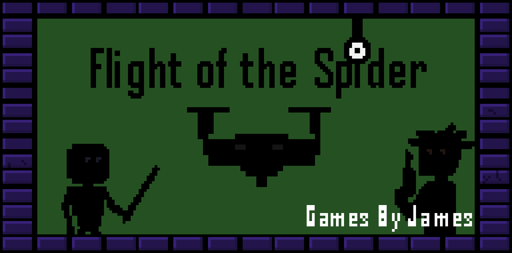
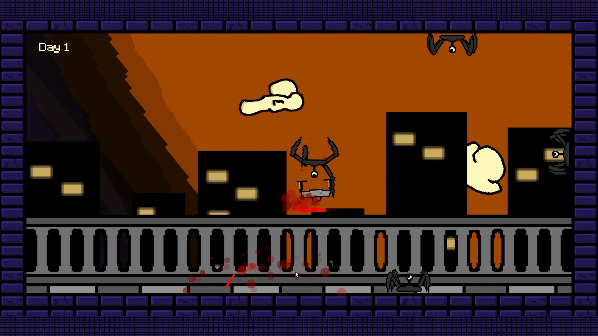

# Flight of the Spider

How long can you survive against the spider invasion?

[Play it on itch.io](https://gamesbyjames.itch.io/flight-of-the-spider)

[Watch gameplay on YouTube](https://youtu.be/5c05G_F-yYs)

This is a game I made in Summer 2021. The initial prototype was made for the 2021 GMTK game jam. I think the game is neat enough, so I decided to dust it off and post it.

(I had only completed one year of my computer science degree when working on this; don't judge the code quality.)

## Other playable characters
If you review the code, you'll find that there are a lot of dormant features that I implemented but don't have active for this version of the game. I was working with a lot of really cool concepts here, but I think that at the time I just didn't have the skills and foresight to set them all up in a way that made a game cohesive or fun.

The initial game was called "Squad Up", and had several characters that the user could choose from: in addition to the drone, there was the katana-wielding ninja who can climb on the ceiling and walls, the grappler who can shoot and repel on grappling hooks, and a (boring) default character named Tak. These characters each had AI that would let them run around and fight enemies, and the user could switch between characters to play as mid-battle. It was a really neat concept, but had issues. It was cramped, there was too much going on, and the characters were unbalanced. This simplified game where the drone just survives unending waves of spiders is a lot better at being a cohesive and fun game.

I still think the ninja and grappler characters are really cool, so if I get a wild hair one day I may make an individual level for each of those two characters. The characters are unbalanced, so the levels would have to be significantly distict for users to not just choose the same character each time. I would need to make levels that really play into each character's strengths and weaknesses.